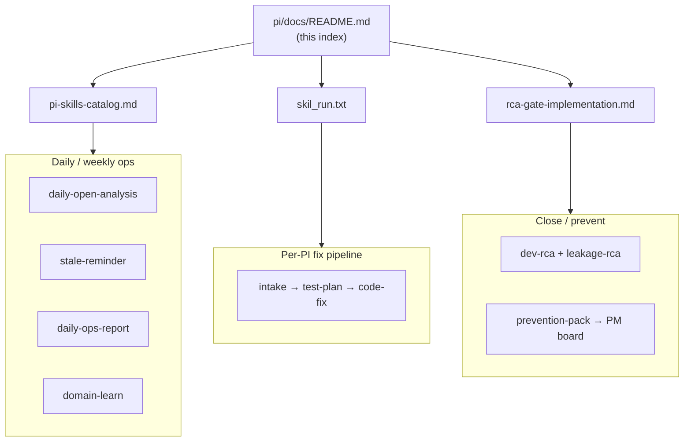

# PI documentation index

**Entry point** for the PI repo (`current/pi/`). Use this page to find docs, skills, automation, and reports.

**Last updated:** 2026-09-16 · ← [Workspace doc index](../../DOCS-INDEX.md)

Skill counts and run metadata: [`engineering-intelligence/control-center/skills-registry.json`](../../engineering-intelligence/control-center/skills-registry.json) (prefer over prose catalogs).

---

## Start here

| I want to… | Go to |
| --- | --- |
| **Find any workspace doc** | [`DOCS-INDEX.md`](../../DOCS-INDEX.md) |
| **See everything (PI + AWS + Jira + cron + …)** | [`engineering-intelligence/AUTOMATION-INVENTORY.md`](../../engineering-intelligence/AUTOMATION-INVENTORY.md) — auto-generated workspace catalog |
| **See PI skills/scripts only** | [**PI inventory**](pi-inventory.md) |
| **PI skills table + on-demand run** | [**PI-SKILLS-SUMMARY.md**](PI-SKILLS-SUMMARY.md) |
| **Run a skill or scheduled job** | [**Skills catalog**](pi-skills-catalog.md) — chat prompts, CLI, double-click `.command` files |
| **Process one PI end-to-end** | [`pi/skil_run.txt`](../skil_run.txt) (ordered steps) + [pipeline flags](pi-pipeline-config.md) |
| **Learn FO vs enterprise treasury from PIs** | [fo-enterprise-learn-index.md](fo-enterprise-learn-index.md) · glossary [fo-enterprise-domain-map.md](fo-enterprise-domain-map.md) |
| **See open queues / RCA gaps** | Refresh [ops dashboard](../reports/pi-ops-dashboard.html) · `open "current/pi/Refresh PI Dashboard.command"` |
| **Open PI summary → per-PI hubs** | [**PI-SUMMARY.md**](../reports/PI-SUMMARY.md) · per ticket [`summaries/{KEY}.md`](../summaries/) · cron Mon–Fri **14:30 IST** |
| **PI skills (tabular + run commands)** | [**PI-SKILLS-SUMMARY.md**](PI-SKILLS-SUMMARY.md) · canonical counts in `skills-registry.json` |
| **RCA gate & prevention backlog** | [RCA gate implementation](rca-gate-implementation.md) |
| **UAT test evidence gate (draft)** | [uat-test-evidence-gate-findings.md](uat-test-evidence-gate-findings.md) |
| **Validate repo setup** | [validate-pi-setup.md](validate-pi-setup.md) |
| **New clone / folder layout** | [pi-folder-setup.md](pi-folder-setup.md) |

---

## Double-click runners (`current/pi/`)

**Do not click `.command` links in Cursor** — the editor tries to open them as files and the path often fails when the workspace root is `av/` (parent of `current/`). Use **Finder**, **Terminal `open`**, or the **CLI** below instead.

| File | When |
| --- | --- |
| `Run PI Weekday Morning.command` | ~10 AM IST — open-PI analysis + stale reminders |
| `Run PI Weekday Morning (dry-run).command` | Preview only, no Jira comments |
| `Run PI Open Summary.command` | ~2:30 PM IST weekdays — L1 open-PI index + per-PI hubs |
| `Refresh PI Dashboard.command` | Live Jira → HTML dashboard |
| `Run PI Daily Ops (5 PM).command` | ~5 PM IST — ops email + dashboard |
| `Run Developer Domain Learn.command` | Weekly — tune developer assignment rules |
| `Run PI Monthly Ageing.command` | 1st of month — ageing snapshot |

All runners live in **`current/pi/`** (also reachable as **`pi/`** via symlink at workspace root).

**Terminal (from workspace root `av/`):**

```bash
open "current/pi/Run PI Weekday Morning.command"
open "current/pi/Run PI Weekday Morning (dry-run).command"
open "current/pi/Refresh PI Dashboard.command"
```

**CLI equivalent (weekday morning):**

```bash
cd jira && source .venv/bin/activate
python -m scripts.jira_automation daily-open-analysis
python -m scripts.jira_automation stale-remind          # omit for dry-run; add --dry-run to preview
```

Detail and full CLI table: [**pi-skills-catalog.md**](pi-skills-catalog.md).

---

## Documentation map

### Operations & process

| Doc | Purpose |
| --- | --- |
| [**pi-inventory.md**](pi-inventory.md) | **PI catalog** — 31 skills + scripts + runners (PI only) |
| [**Workspace automation catalog**](../../engineering-intelligence/AUTOMATION-INVENTORY.md) | All domains — auto-generated; regen via `engineering-intelligence/scripts/generate_automation_inventory.py` |
| [**pi-skills-catalog.md**](pi-skills-catalog.md) | **Skills runbook** — all 31 skills, Jira CLI, discovery symlinks |
| [pi-pipeline-config.md](pi-pipeline-config.md) | Optional pipeline flags (business impact, RCA skills, prevention, UAT DB trial) |
| [uat-db-disprovers-trial.md](uat-db-disprovers-trial.md) | UAT DB disprover trial (read-only SQL disprovers per tenant) |
| [jira-pi-board-status.md](jira-pi-board-status.md) | Board 774 columns ↔ Jira status names |
| [chat-backlog-tracker.md](chat-backlog-tracker.md) | Cross-chat task tracker |
| [process-log.md](process-log.md) | Optional dated log of skill runs |

### RCA, prevention & assignment

| Doc | Purpose |
| --- | --- |
| [rca-gate-implementation.md](rca-gate-implementation.md) | Dev + Leakage RCA gate (→ In QA), PM prevention project |
| [uat-test-evidence-gate-findings.md](uat-test-evidence-gate-findings.md) | **Draft** — UAT test-evidence attachment audit & phased gate recommendations |
| [pi-special-cases.md](pi-special-cases.md) | Bug vs data correction, triage nuance |
| [cross-cutting-impact-dimensions.md](cross-cutting-impact-dimensions.md) | Impact matrix dimensions for intake |
| [fo-enterprise-domain-map.md](fo-enterprise-domain-map.md) | FO → enterprise treasury learning glossary (business-impact) |
| [fo-enterprise-learn-index.md](fo-enterprise-learn-index.md) | Cumulative dual-lens rows from PIs |
| [input/team/developer-domains.json](../input/team/developer-domains.json) | Auto-assign rules (intake) |
| [input/team/developer-domains-changelog.md](../input/team/developer-domains-changelog.md) | Domain-learn apply history |

### Product strategy (moved off `pi/docs/`)

| Doc | Purpose |
| --- | --- |
| [`av-docs/ibor-abor-other-businesses.md`](../../av-docs/ibor-abor-other-businesses.md) | Overlay map — FO / RIA / CPA on one kernel |
| [`av-docs/ibor-abor-overlay-tam-margins.md`](../../av-docs/ibor-abor-overlay-tam-margins.md) | Overlay TAM and margins |
| [`av-docs/tf-canada/`](../../av-docs/tf-canada/) | Truly Financial Canada diversification specs |

Stubs remain under `pi/docs/` for old links.

### Setup & reference

| Doc | Purpose |
| --- | --- |
| [pi-folder-setup.md](pi-folder-setup.md) | Folder layout summary |
| [validate-pi-setup.md](validate-pi-setup.md) | Setup validation checklist |
| [specs/README.md](../specs/README.md) | `pi.csv` schema + fix spec files |
| [user_manual/README.md](../user_manual/README.md) | Product behavior guides (intake / tests) |
| [evidence-analysis/README.md](../evidence-analysis/README.md) | Evidence analysis outputs |

### Jira automation (sibling repo)

| Location | Purpose |
| --- | --- |
| `jira/scripts/jira_automation/` | Python CLI (`python -m scripts.jira_automation …`) |
| `jira/docs/PI_REPORTING_DELIVERABLES.md` | Dashboards, filters, reporting (if present) |
| `jira/output/` | Discovery, migration, ageing JSON exports |

Prerequisite: `cd jira && source .venv/bin/activate && python -m scripts.jira_automation ping`

---

## Workflows (which doc / skill?)



| Workflow | Skills / commands | Key outputs |
| --- | --- | --- |
| **Everything I have** | See [**pi-inventory.md**](pi-inventory.md) | one-page catalog |
| **Morning ops** | `pi-daily-open-analysis`, `pi-stale-assignee-reminder` | `reports/pi-ops-dashboard.*`, `daily-ops-*.md` |
| **5 PM ops** | `pi-daily-ops-report` | `reports/daily-ops-YYYY-MM-DD.md` |
| **Fix one PI** | See `skil_run.txt` | `specs/`, `ops/debug/`, `test-plans/`, code PRs |
| **Your debug / RCA** | `pi-debug-playbook` | `ops/debug/{KEY}-playbook.md`, `my-rca.md` |
| **Manager / exec meetings** | `pi-meeting-brief`, `pi-executive-narrative`, `pi-friday-rca-sync` | `reports/meeting-brief-*.md`, `executive-narrative-*.md` |
| **PI catalog** | `pi-master-index` | `reports/pi-master-index.md` |
| **RCA at handoff** | `pi-dev-rca`, `pi-leakage-rca` | Jira fields + `ops/drafts/` |
| **Prevention** | `pi-prevention-pack` | `ops/drafts/*-prevention-pack.md` → PM project |
| **Assignment learn** | `pi-developer-domain-learn` | `reports/developer-domain-learn-*.md` |

---

## Artifact directories

| Path | Contents |
| --- | --- |
| `pi/specs/` | Fix specifications `{PB-xxxx}.md` |
| `pi/test-plans/` | Test plans per PI |
| `pi/similar/` | Similar-PI search results |
| `pi/impact/` | Optional impact write-ups |
| `pi/business-impact/` | Business impact sections |
| `pi/evidence-analysis/` | Evidence analysis |
| `pi/ops/drafts/` | RCA, prevention, domain-learn proposals (human review) |
| `pi/ops/debug/` | Your debug playbooks, sessions, my-rca (`pi-debug-playbook`) |
| `pi/reports/` | Daily ops, dashboards, master index, meeting briefs |
| `pi/input/` | URLs, team roster, evidence zips, pending CSVs |
| `pi/ops/disprovers/` | UAT DB disprover trial logs (`pi-uat-db-disprovers`) |
| `pi/scripts/`, `pi/tools/` | Python utilities (one-off Book2 generators + `uat_db_disprovers.py`) |
| `pi/skills/` | Canonical skill definitions (31) |

---

## Jira boards

| Board | Key | Doc |
| --- | --- | --- |
| [PI Board 774](https://assetvantage.atlassian.net/jira/software/c/projects/PB/boards/774) | `PB` | [jira-pi-board-status.md](jira-pi-board-status.md) |
| [Problem Management 1144](https://assetvantage.atlassian.net/jira/software/c/projects/PM/boards/1144) | `PM` | [rca-gate-implementation.md](rca-gate-implementation.md) § Part 2 |

---

## Recent initiative reports (2026-06)

| Report | Topic |
| --- | --- |
| [prevention-assign-validation-2026-06-14.md](../reports/prevention-assign-validation-2026-06-14.md) | Prevention-pack pilot + developer auto-assign |
| [developer-domain-learn-2026-06-14.md](../reports/developer-domain-learn-2026-06-14.md) | Assignment rule learning baseline |
| [closed-2w-rca-2026-06-12.md](../reports/closed-2w-rca-2026-06-12.md) | Closed PI RCA coverage |

---

## Skills discovery (no duplication)

- **Source:** `pi/skills/<name>/SKILL.md`
- **Cursor:** `.cursor/skills/<name>` → symlink only

Full table: [**pi-skills-catalog.md**](pi-skills-catalog.md) § Skills catalog.

---

## Adding to this index

When you add a skill, doc, or `.command` runner:

1. Register in [**pi-skills-catalog.md**](pi-skills-catalog.md) (if runnable).
2. Add a row to the relevant section **here**.
3. Link back to this file from the new doc’s first paragraph.
