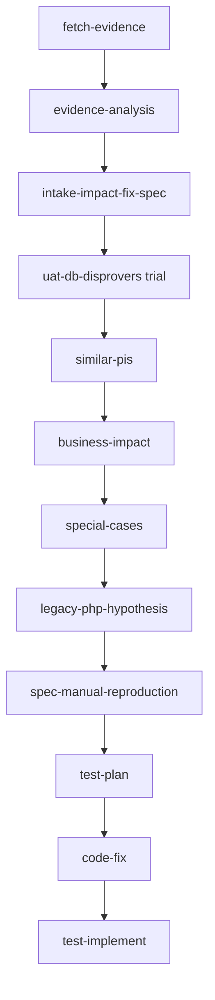

# PI skills catalog — runbook

**PI index:** [`README.md`](README.md) — all docs, workflows, reports, and artifact paths.  
**This file:** runnable skills, CLI commands, and double-click runners.

| Related docs | |
| --- | --- |
| **PI index** | [`pi/docs/README.md`](README.md) |
| **Workspace automation catalog** | [`engineering-intelligence/AUTOMATION-INVENTORY.md`](../../engineering-intelligence/AUTOMATION-INVENTORY.md) (auto-generated) |
| **PI-only inventory** | [`pi/docs/pi-inventory.md`](pi-inventory.md) |
| Fix pipeline order | [`pi/skil_run.txt`](../skil_run.txt) |
| Optional pipeline flags | [`pi/docs/pi-pipeline-config.md`](pi-pipeline-config.md) |
| RCA gate & prevention | [`pi/docs/rca-gate-implementation.md`](rca-gate-implementation.md) |
| Folder layout | [`pi/docs/pi-folder-setup.md`](pi-folder-setup.md) |
| Setup validation | [`pi/docs/validate-pi-setup.md`](validate-pi-setup.md) |

---

## Skill discovery (no duplication)

**Single source of truth:** `current/pi/skills/<skill-name>/SKILL.md`

**Cursor discovery:** `.cursor/skills/<skill-name>` → symlink only (never a copy).

```bash
# Verify one skill (expect symlink → current/pi/skills/…)
ls -la .cursor/skills/pi-intake-impact-fix-spec

# Re-link all skills after adding a new one under pi/skills/
cd /path/to/workspace
for d in current/pi/skills/*/; do
  name=$(basename "$d")
  ln -sf "../../current/pi/skills/$name" ".cursor/skills/$name"
done
```

Edit skills **only** under `current/pi/skills/`. Symlinks pick up changes immediately.

**Prerequisites (most CLI / skills):**

```bash
cd jira && source .venv/bin/activate && python -m scripts.jira_automation ping
```

---

## Quick run — schedules (double-click)

macOS **Finder → double-click** (or `open` from terminal). All live under `current/pi/` (symlink: `pi/` at workspace root).

**Live cron status:** [`cron/scheduled-jobs-status.html`](../../cron/scheduled-jobs-status.html) — refresh with `open "cron/Refresh Scheduled Jobs Status.command"` or `python -m scripts.jira_automation schedule-status --open`.

**Full reference:** [`cron/SCHEDULED-JOBS-REFERENCE.md`](../../cron/SCHEDULED-JOBS-REFERENCE.md) — architecture, enable cron, troubleshooting, add jobs.

**Cursor:** do not click `.command` links in markdown — use Finder or `open "current/pi/<runner>.command"` from terminal.

| When | Runner | What it does |
| --- | --- | --- |
| **~10 AM IST weekdays** | `Run PI Weekday Morning.command` | Open-PI analysis + stale assignee Jira comments |
| **~10:04 AM IST weekdays** | `Run PI Daily Deep Dive.command` | Queue 5 IN DEVELOPMENT PIs + Bitbucket; then chat `pi-daily-deep-dive` |
| **~10:05 AM IST daily** | `Run PI Non-Eng Disposition.command` | Feedback / Convert_To_CR / Closed-no-eng dispositions |
| **~10:06 AM IST daily** | `Run PI Detail Elaboration.command` | Bitbucket refresh + open-PI ready/thin queue (agent elaborates) |
| **~10 AM preview** | `Run PI Weekday Morning (dry-run).command` | Same, no Jira comments |
| **Anytime / before 5 PM** | `Refresh PI Dashboard.command` | Live Jira → `pi/reports/pi-ops-dashboard.html` + browser |
| **~5 PM IST weekdays** | `Run PI Daily Ops (5 PM).command` | Daily ops email markdown + dashboard refresh |
| **Weekly (e.g. Monday)** | `Run Developer Domain Learn.command` | Tune `developer-domains.json` from recent assignments |
| **1st of month** | `Run PI Monthly Ageing.command` | Open-PI ageing snapshot for retro |
| **Weekly (exec)** | `Run PI Executive Weekly.command` | Monday ~9 AM IST — paste `pi/reports/executive-weekly.md` |
| **Daily (exec preventability)** | `Run PI Daily Executive Analysis.command` | Daily 09:30 IST — volume + reconcile + `pi/reports/executive-mtd-preventability.md` |
| **Thu 10:30 IST** | `Run PI Regression Map.command` | Refresh `pi/docs/regression-suite-map.json` from avautomation Develop |
| **Mon–Fri 10:35 IST** | `Run PI UAT Evidence Review.command` | In QA PIs: evidence vs regression benchmark + Jira comment |
| **Preview (no Jira comment)** | `Run PI UAT Evidence Review (dry-run).command` | Same reviews, reports only |
| **Fri 11:00 IST** | `Run PI UAT Weekly Report.command` | Weekly rollup for automation lead |

---

## Per-PI fix pipeline (order)

Use [`pi/skil_run.txt`](../skil_run.txt) as the ordered checklist. Replace `<PB-KEY>` (e.g. `PB-2888`).



---

## Skills catalog

**How to run in Cursor:** paste the **Chat prompt** into Agent chat (skill loads via `.cursor/skills/` symlink).

| Skill | Purpose | Schedule / trigger | Chat prompt | CLI (if any) |
| --- | --- | --- | --- | --- |
| **pi-regression-map** | `avautomation` Develop vs master → `pi/docs/regression-suite-map.json` + `.md` | Thu 10:30 / before UAT review | `pi-regression-map` | `python3 pi/scripts/regression_suite_map.py` |
| **pi-uat-evidence-review** | In QA column: evidence vs regression benchmark + Jira comment | Mon–Fri 10:35 | `pi-uat-evidence-review --uat-column --live` | `uat-evidence-review --uat-column --live` |
| **pi-uat-weekly-report** | Weekly rollup for automation lead | Fri 11:00 | `pi-uat-weekly-report` | `uat-weekly-report` |
| **pi-fetch-evidence** | Jira attachments → `pi/input/pi-evidence/{KEY}.zip` | Per PI, step 1 | `pi-fetch-evidence PB-xxxx` | `fetch-evidence PB-xxxx` |
| **pi-evidence-analysis** | Open images/CSV/Excel in zip → content-level `pi/evidence-analysis/` (reject inventory boilerplate) | Per PI, step 2 (mandatory when zip exists) | `pi-evidence-analysis PB-xxxx` | — |
| **pi-intake-impact-fix-spec** | Intake, URL, team, evidence anchors, hypotheses → `pi/specs/`; **per-run summary** → `pi/reports/intake-summary-YYYY-MM-DD.md` (HC UAT links) | Per PI, step 3; **sequential** batches; requires step 2 when zip exists | `pi-intake-impact-fix-spec PB-xxxx` | `assign-developer suggest PB-xxxx` only (apply after human review) |
| **pi-uat-db-disprovers** | **Trial:** read-only SQL disprovers → `pi/ops/disprovers/` | After intake; `uat_db_disprovers_trial` | `pi-uat-db-disprovers PB-xxxx` | `python pi/scripts/uat_db_disprovers.py PB-xxxx` |
| **pi-similar-pis** | Jira similar-PI search → `pi/similar/` | Per PI (also in intake) | `pi-similar-pis PB-xxxx` | `similar-pis PB-xxxx` |
| **pi-business-impact** | Business impact section (optional) | Per PI; default ON | `pi-business-impact PB-xxxx` | — |
| **pi-special-cases** | Cross-cutting matrix + special cases | Per PI, before code fix | `pi-special-cases PB-xxxx` | — |
| **pi-legacy-php-hypothesis** | PHP vs lambda boundary | When report/calc paths | `pi-legacy-php-hypothesis PB-xxxx` | — |
| **pi-spec-manual-reproduction** | Reproduction steps in spec | Per PI | `pi-spec-manual-reproduction PB-xxxx` | — |
| **pi-test-plan** | Test plan → `pi/test-plans/` | Before code fix | `pi-test-plan PB-xxxx` | — |
| **pi-test-plan-reconcile** | Post-RCA + cross-cutting prevention in test plan | After fix + RCAs | `test-plan-reconcile --mtd-fixed` | Daily exec preventability links |
| **pi-code-fix** | Application code fix (man-in-loop) | After approved spec | `pi-code-fix PB-xxxx` | — |
| **pi-test-implement** | Implement tests | After code fix | `pi-test-implement PB-xxxx` | — |
| **pi-eta** | Draft Client Committed Timeline | Open PIs, on demand | `pi-eta PB-xxxx` | — |
| **pi-dev-rca** | Draft Dev RCA (`customfield_10935`) | Post-eng / close | `pi-dev-rca PB-xxxx` | — |
| **pi-leakage-rca** | Draft Leakage RCA dropdown | Post-eng / close | `pi-leakage-rca PB-xxxx` | — |
| **pi-rca-human-enhancement** | Enrich spec RCA from human notes | On demand | `pi-rca-human-enhancement PB-xxxx` | — |
| **pi-prevention-pack** | Post-close PM Story + Tasks draft | Manual, both RCAs set | `pi-prevention-pack PB-xxxx` | `prevention-pack check/create PB-xxxx` |
| **pi-developer-domain-learn** | Learn assignment rules from closed PIs | Weekly | `pi-developer-domain-learn` | `domain-learn run` / `apply` |
| **pi-assign-engineering-queue** | In Engineering Queue: auto-assign Developer+Team when both empty → IN DEVELOPMENT | On demand | `pi-assign-engineering-queue` | `assign-engineering-queue` [--dry-run] |
| **pi-daily-open-analysis** | Morning open-PI snapshot | Weekdays ~10 AM | `pi-daily-open-analysis` | `daily-open-analysis` |
| **pi-non-eng-disposition** | Feedback / Convert_To_CR / Closed-no-eng + gaps + draft suggestions (no Jira write) | Daily 10:05; 1st run Jun–Jul backlog | `pi-non-eng-disposition` | `non-eng-disposition-report` |
| **pi-detail-elaboration** | Open PIs: ready vs thin; coach reporters; Bitbucket refresh; agent drafts (no Jira write) | Daily 10:06 | `pi-detail-elaboration` | cron queue only |
| **pi-cr-candidate** | Codebase check: Stay PI vs Convert to CR (no implementation **or** new capability/enhancement) | On demand / from deep dive | `pi-cr-candidate PB-xxxx` | — |
| **pi-daily-deep-dive** | Boss learning ritual: deep-analyze **5** IN DEVELOPMENT PIs; fetch+evidence analysis when attachments exist; enrichment MD (no invented intake); includes CR check | **Mon–Fri 10:04** queue + chat | `pi-daily-deep-dive` | cron `pi-daily-deep-dive` |
| **pi-stale-assignee-reminder** | Stale assignee Jira comments | After daily-open | `pi-stale-assignee-reminder` | `stale-remind` |
| **pi-daily-ops-report** | 5 PM ops email markdown | Weekdays ~5 PM | `pi-daily-ops-report` | `daily-ops-report` |
| **pi-triage-emails** | Exec progress + ETA chase + weekly RCA HTML (opens browser) | **Daily 17:05 IST (all 7 days)** | `pi-triage-emails` | `triage-emails` |
| **pi-blueocean-new-pi-watch** | macOS notify on newly created BlueOcean PIs | **Mon–Fri every 2h 09:30–17:30 IST** | `pi-blueocean-new-pi-watch` | `blueocean-new-pi-watch` |
| **pi-monthly-ageing** | Monthly open-PI ageing | 1st of month | `pi-monthly-ageing` | `ageing` |
| **pi-monthly-retro-deck** | Prior-month PI retro PPTX (8-slide, OneDrive, auto-versioned) | **First working day 11:15 IST** | `pi-monthly-retro-deck` | `pi-management-retro-deck` |
| **pi-monthly-mr-deck** | Prior-month MR deck PPTX + CSV sidecars | **First working day 11:20 IST** | `pi-monthly-mr-deck` | `monthly-engineering-deck` + `export-mr-excel-sidecars` |
| **pi-executive-weekly-report** | Exec weekly email: reported / resolved / plan | **Monday ~9 AM IST** | `pi-executive-weekly-report` | `executive-weekly-report` |
| **pi-daily-executive-preventability** | MTD preventability for fixed PIs + cross-cutting summary | **Daily 09:30 IST** | `pi-daily-executive-preventability` | `mtd-preventability-report` |
| **pi-debug-playbook** | Your debug breakpoints, session log, my RCA vs Jira Dev RCA | On demand after intake | `pi-debug-playbook generate PB-xxxx` | — |
| **pi-master-index** | Cumulative PI catalog with artifact links | After intake batches | `pi-master-index` | — |
| **pi-meeting-brief** | Daily manager sync: critical/high + business one-liners | Weekdays ~10 AM | `pi-meeting-brief` | — |
| **pi-friday-rca-sync** | Friday RCA rollup: your RCA vs dev Jira, gaps | Fridays | `pi-friday-rca-sync` | — |
| **pi-rca-reduction-brief** | Friday leads brief: cluster Dev RCA, recurrences, reduction levers | **Fri 14:00 IST** | `pi-rca-reduction-brief` | `rca-reduction-brief` |
| **pi-leakage-coverage-funnel** | Leakage RCA → regression gap funnel (open vs closed coverage) | **Fri 14:00 IST** | `pi-leakage-coverage-funnel` | `leakage-coverage-funnel` |
| **pi-incoming-reduction-ideate** | Crowdsource NEW MoM PI-reduction levers (exclude AO-56); pending draft → approve | **Fri 14:15 IST** (+ chat deepen) | `pi-incoming-reduction-ideate` | `incoming-reduction-ideate run\|status\|approve\|reject` |
| **pi-executive-narrative** | Exec volume + critical open business view | Mon + Thu ~9 AM | `pi-executive-narrative` | — |

**Skill source paths:** `current/pi/skills/<name>/SKILL.md` (symlink each new skill under `.cursor/skills/`).

---

## Daily & weekly ops (detail)

### Weekday morning (~10 AM IST)

1. `open "current/pi/Run PI Weekday Morning.command"` — or chat: `pi-daily-open-analysis` then `pi-stale-assignee-reminder`
2. Review `current/pi/reports/pi-ops-dashboard.html`
3. `open "current/pi/Run PI Daily Deep Dive.command"` (or wait for 10:04 cron) — then chat `pi-daily-deep-dive` with queued keys
4. Review `current/pi/reports/daily-deep-dive-queue.md` → after agent: `daily-deep-dive-YYYY-MM-DD.md`
5. `open "current/pi/Run PI Non-Eng Disposition.command"` (or wait for 10:05 cron) — Feedback / Convert_To_CR / Closed-no-eng
6. Review `current/pi/reports/non-eng-disposition.md`
7. `open "current/pi/Run PI Detail Elaboration.command"` (or wait for 10:06 cron) — then chat `pi-detail-elaboration` for thin PIs
8. Review `current/pi/reports/pi-detail-elaboration.md`

### Daily ops email (~5 PM IST)

1. `open "current/pi/Run PI Daily Ops (5 PM).command"` — or `daily-ops-report`
2. Paste from `current/pi/reports/daily-ops-YYYY-MM-DD.md`

### Weekly developer-domain learn

1. `open "current/pi/Run Developer Domain Learn.command"`
2. Review `current/pi/reports/developer-domain-learn-YYYY-MM-DD.md`
3. Edit `current/pi/ops/drafts/developer-domains-proposed-YYYY-MM-DD.json`
4. Apply when ready: `domain-learn apply --from …` (human approval)

### Executive weekly (Monday ~9 AM IST)

1. Edit `current/pi/input/executive-weekly-plan.json` if planned counts are not in Jira ETA.
2. `open "current/pi/Run PI Executive Weekly.command"` — or `executive-weekly-report`
3. Paste from `current/pi/reports/executive-weekly.md` (subject line is first row).

### Monthly ageing (1st of month)

1. `open "current/pi/Run PI Monthly Ageing.command"`
2. Outputs: `jira/output/pi_ageing_YYYY-MM.json` + `.md`

### Executive weekly (leadership)

1. `open "current/pi/Run PI Executive Weekly.command"` — or `executive-weekly-report`
2. Paste from `current/pi/reports/executive-weekly-YYYY-MM-DD.md`
3. **Narrative (2×/week):** chat `pi-executive-narrative` → `pi/reports/executive-narrative-YYYY-MM-DD.md`

### Manager brief (weekdays)

1. After morning ops: chat `pi-meeting-brief` → `pi/reports/meeting-brief-YYYY-MM-DD.md`

### Friday incoming-PI reduction (14:00 IST)

1. `open "current/pi/Run PI Incoming PI Reduction (Friday).command"` — or cron `pi-incoming-pi-reduction-friday`
2. Review `pi/reports/rca-reduction-brief.md` (Dev RCA failure-mode clusters, recurrences)
3. Review `pi/reports/leakage-coverage-funnel.md` (Leakage → regression gap funnel)
4. Optional: chat `pi-friday-rca-sync` for your debug RCA vs Jira alignment
5. **Ideate (Fri 14:15 cron):** `pi-incoming-reduction-ideate` job opens `pi/ops/drafts/ideation-pending.md`
6. Optional chat deepen → then approve:
   ```bash
   python -m scripts.jira_automation incoming-reduction-ideate approve --ranks 1,2
   # only when promoting to AO-56:
   python -m scripts.jira_automation incoming-reduction-ideate approve --ranks 1,2 --create
   ```
   Manual launcher: `open "current/pi/Run PI Incoming Reduction Ideate.command"`

### Master index + debug playbook

1. After intake batch: `pi-master-index` → `pi/reports/pi-master-index.md`
2. Per PI: `pi-debug-playbook generate PB-xxxx` → `pi/ops/debug/PB-xxxx-playbook.md`

---

## Jira CLI reference

From `jira/` with venv active: `python -m scripts.jira_automation <command>`

| Command | Purpose |
| --- | --- |
| `ping` | Verify Jira credentials |
| `dashboard` | Refresh ops dashboard HTML |
| `daily-open-analysis` | Morning open-PI report |
| `daily-ops-report` | 5 PM ops email body |
| `executive-weekly-report` | Exec weekly: reported/fixed + ETA plan |
| `test-plan-reconcile` | Post-RCA test plan (`--mtd-fixed`) |
| `mtd-preventability-report` | Daily fixed-PI preventability report |
| `rca-reduction-brief` | Friday RCA reduction brief (`--window mtd\|7d\|30d`) |
| `leakage-coverage-funnel` | Leakage → regression gap funnel (`--window mtd\|7d\|30d`) |
| `incoming-reduction-ideate run\|status\|approve\|reject` | Pending MoM PI-reduction levers; `--create` for AO-56 |
| `stale-remind` | Stale assignee comments (`--dry-run`) |
| `ageing` | Monthly ageing (`--as-of YYYY-MM-DD`) |
| `fetch-evidence PB-xxxx` | Download Jira attachments |
| `uat-evidence-review PB-xxxx [--live]` | Single PI UAT evidence review |
| `uat-evidence-review --uat-column --live` | All In QA PIs (cron) |
| `uat-weekly-report` | Weekly UAT evidence rollup |
| `similar-pis PB-xxxx` | Similar PI search |
| `assign-developer suggest/apply PB-xxxx` | Developer + Team assignment |
| `assign-engineering-queue [--dry-run]` | In Engineering Queue → assign + IN DEVELOPMENT |
| `domain-learn run` / `apply` | Learn / merge developer domains |
| `prevention-pack check/create PB-xxxx` | PM prevention backlog |
| `provision-pi` / `provision-pm` | Jira project setup (admin) |
| `discover` / `analyze` | Jira field discovery / data quality |

---

## Optional pipeline flags

See [`pi-pipeline-config.md`](pi-pipeline-config.md). Per-PI override in chat: *"skip business impact for PB-xxxx"*.

---

## Adding a new skill

1. Create `current/pi/skills/<new-skill>/SKILL.md` (YAML `name` + `description`).
2. Symlink: `ln -sf "../../current/pi/skills/<new-skill>" ".cursor/skills/<new-skill>"`
3. Add a row to **this catalog** and to [`pi/skil_run.txt`](../skil_run.txt) if part of the fix pipeline.
4. Do **not** copy SKILL.md into `.cursor/skills/`.
