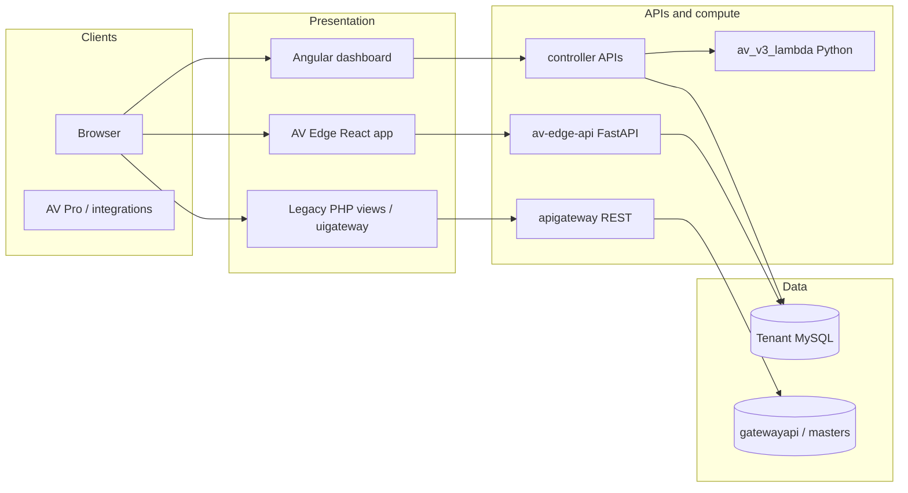

# Asset Vantage — product overview

*This document is grounded in the `av/current` monorepo. It is written for engineers and technical operators; for step-by-step feature guides, see the other files in this folder.*

## What Asset Vantage is

**Asset Vantage (AV)** is a SaaS platform for **high-net-worth family offices** and related wealth operations. It supports **Single Family Office (SFO)** and **Multi Family Office (MFO)** setups and includes **portfolio accounting**, **general ledger**, **performance and benchmarking**, **custodian feeds and reconciliation**, **corporate actions**, **cash and operational workflows**, and rich **reporting** (including report books and dashboards).

Internally, the product spans a **PHP “controller” application** (main business logic and UI server), a **Gateway API** layer and **`gatewayapi` database** (tenant licensing and platform configuration), **Angular** and **React/Vite** frontends, **AWS Lambda** compute for reporting and analytics pipelines, and newer **FastAPI** services (**AV Edge**).

---

## Editions and licensing (product variants)

Customer **editions** are expressed as numeric IDs in code and resolved via `masters.licensetype` (see `controller/public/directory.php` for constants such as `EDITION_BUSINESS`, `EDITION_FAMILY_PRO`, `EDITION_PRIME`). User-facing names include **AV Pro** and **AV Prime** (see trial messaging in `controller/app/library/auth/Auth.php`). Features are often gated by **edition** and **role permissions**.

---

## Terminology you will hear: **license**, **gateway**, and related terms

### License

In AV, **license** refers to the **subscription record for a customer tenant**, not merely a legal document.

- **Per-tenant record**: Stored in the **`license`** table (and mirrored or linked from **`gatewayapi.license`**). Important fields include **`dbname`** (tenant database identifier), **`edition`**, validity dates, trial flags (`trialsubscribed`, `trialstartdate`, `trialexpirydate`), **`productkey`**, **`sessionlimit`**, and branding/account metadata (`name`, `accountname`, etc.).
- **Auth context**: After login, license information flows into the session/JWT path (for example `controller/app/common/service/TokenUser.php` loads edition and license join data).
- **Expiry behaviour**: Trial end and **license expiry** drive banners and **lockout** when renewal grace periods are exceeded (see `controller/app/library/auth/Auth.php`).
- **Operational meaning**: “Check the license” usually means **confirm tenant id/edition, expiry, and database name** — not open-source license text.

### Gateway (multiple meanings — disambiguate by context)

| Meaning | What it is | Where it shows up in code / ops language |
|--------|------------|----------------------------------------|
| **Gateway API (service)** | The PHP application in **`apigateway/`** — header text calls it *AssetVantage Gateway API Framework*. It exposes REST routes under **`/api/{name}`** and uses models bound to the **`gatewayapi`** database connection. | `apigateway/index.php`, `apigateway/core/`, `apigateway/models/` |
| **`gatewayapi` (database/schema)** | MySQL schema(s) holding **platform-wide** data: **`license`**, **`host`**, website signup, **client feed credentials** (`clientfeeddetails`), PCR client mapping, news feeds, etc. Controllers query it with explicit `` `gatewayapi`.`table` `` SQL when coordinating tenant feeds or host settings. | `controller/app/modules/settings/controllers/IndexController.php`, `apigateway/core/License.php`, etc. |
| **“Gateway” in support / PI language** | Often means **the hosted control plane**: **feature toggles**, **feed enablement**, **FX or benchmark “gateway” rates**, or **environment-specific behaviour** (trial vs live). PI notes refer to “enabled on gateway” vs client DB-only settings. | `pi/specs/`, test plans; phrases like “password / gateway feature flag mismatch” |
| **UI Gateway (legacy shell)** | **`uigateway/`** — an **AngularJS** single-page shell whose document title is **“Gateway”**. It loads API/UI URLs from environment (`gatewayinfo.php`) and is part of the older gateway administration UX stack. | `uigateway/index.php` |
| **AWS API Gateway** | In cloud deployments, **Amazon API Gateway** may front Lambdas or HTTP APIs — this is **infrastructure**, not the PHP Gateway API above. | `devops/`, Lambda/API stacks |

**Rule of thumb:** If someone says “fix it on gateway,” clarify whether they mean **(a)** the **Gateway API / `gatewayapi` DB**, **(b)** a **feature flag** for that tenant, or **(c)** **market/FX data** sourced from platform feeds rather than transaction-local rates.

---

## Repository map (high level)

| Area | Role |
|------|------|
| **`controller/`** | Main **Phalcon/PHP** application: modules for **user**, **masters**, **reports**, **bank/cash**, transactions, settings, APIs consumed by the UI. Owns most **business rules** and report generation. |
| **`dashboard/`** | **Angular** SPA (“Asset-Vantage” in README) — primary modern web UI for many workflows. |
| **`apigateway/`** | **Gateway API** — REST facade and **`gatewayapi`**-backed operations (licensing helpers, website user flows, preferences, etc.). |
| **`uigateway/`** | Legacy **AngularJS** “Gateway” UI shell for administrative/configuration scenarios. |
| **`av-edge-api/`** | **FastAPI** services (e.g. health, templates, policy/report-adjacent routes, concentration/churn/alpha routes) — newer API surface, DB via async layer. |
| **`av-edge-web-app/`** | **React + Vite** configuration UI for AV Edge; JWT-driven system name and environment-based API URLs. |
| **`av_v3_lambda/`** | **Python** Lambdas: **performance API** (TWR/IRR/benchmarks), **AUM**, **income statement** phases, **positions**, **PCR lot relief**, **cash balance**, **autosync**, **autopost** email statement flows, etc. |
| **`pcr/`** | **Portfolio Custodian Reconciliation** (and related) — PHP/service code with security traits, repositories, commands; integrates with gateway-backed PCR client mapping. |
| **`printserver/`** | **Node + Chrome** report-book PDF/print pipeline (“Report Book Print Server”). |
| **`pi/`** | **Process improvement**: specs, test plans, **user manual** markdown (`pi/user_manual/`), skills — operational knowledge base. |
| **`docs/`** | Architecture notes (e.g. PAR analysis), plans — verify dates against code. |
| **`devops/`**, **`delivery-engineering/`** | Deployment and pipeline assets. |
| **`tutorial/`** | Curated **learning sequences** from product workflows to code anchors (`tutorial/domain-learning-sequences.md`). |
| **`balancesheet/`**, **`shortsell/`** | Focused subsystems / deployments (see each folder for scope). |

---

## How requests typically flow (conceptual)

Not every path applies to every feature; some reporting-heavy flows deliberately use **Lambda** for scale.

---

## Domain capabilities (summary)

Aligned with the tutorial sequences and user-manual themes:

- **Accounting**: Chart of accounts, GL, consolidation, multi-entity.
- **Investments**: Equities, funds, fixed income, derivatives, private equity, PMS, managed accounts, partnerships.
- **Operations**: Corporate actions, tax lots, CBA, bank/cash, feeds and reconciliation.
- **Analytics**: Performance (e.g. TWR/IRR/MPPR), benchmarks, report books and widgets.

Code anchors for deeper learning are listed in **`tutorial/domain-learning-sequences.md`**.

---

## AI opportunities

For a dedicated discussion of **AI use cases** (ingestion, copilots, reconciliation, FinOps, etc.) and alignment with the internal hackathon programme, see:

**[`docs/AV_AI_PLAYBOOK.md`](../../docs/AV_AI_PLAYBOOK.md)** (hackathon programme **Part A** + executable backlog **Part B**)  
For **stateful vs stateless scaling** and print-service notes: **[`docs/AV_PLATFORM_SCALING_AND_STATELESSNESS.md`](../../docs/AV_PLATFORM_SCALING_AND_STATELESSNESS.md)**

---

## Document maintenance

- Prefer **code and `tutorial/` sequences** over stale prose when they disagree.
- When editing **license or gateway** behaviour, coordinate **`controller`**, **`apigateway`**, and **`gatewayapi`** schema changes together.
